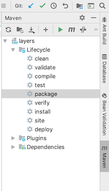

## how to use:

1. Download or clone the project
2. Use IntelliJ IDEA to **open** the projekt
3. Select "Add as Maven Project" on the upcoming alert  
   
4. Run Maven package  
    
5. Start docker
6. Select the docker-compose.yml and press the  Button on line 3
7. App will be available at http://localhost:18000/ in a couple of seconds